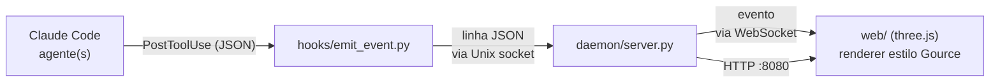

# graph-agents

Visualização **web, em tempo real**, do que cada agente do Claude Code está fazendo —
criação, edição e exclusão de arquivos e diretórios — renderizada com o visual do
[Gource](https://gource.io/). Diferente do Gource (um binário desktop), roda no navegador.

Cada agente aparece como um **ator** que emite feixes até os arquivos que toca; os arquivos
são pontos brilhantes coloridos numa árvore de diretórios com layout por forças e efeito de
_bloom_ — o traço característico do Gource.

> **Estado:** MVP web funcional, verificado ponta a ponta. O visual em navegador ainda não
> foi validado visualmente. Veja [Status e limitações](#status-e-limitações).

---

## Como funciona

Não reimplementamos a captura do zero nem embutimos o código do Gource: aproveitamos os
**hooks do Claude Code** para capturar as operações de arquivo e replicamos o visual do Gource
em WebGL (three.js).



1. **Captura** — um hook `PostToolUse` (em `Write`/`Edit`/`MultiEdit`/`Bash`) dispara
   `hooks/emit_event.py`, que apenas **encaminha** o JSON cru do evento. O hook é _stdlib pura_,
   sem dependências, e **sempre sai com código 0** — nunca trava a sessão do Claude Code.
2. **Normalização + agregação** — `daemon/server.py` recebe os eventos por um _Unix socket_,
   normaliza cada um para o formato de fio e decide `A` (added) vs `M` (modified) mantendo o
   conjunto de caminhos já vistos (nada de sondar o filesystem no caminho quente).
3. **Transmissão** — o daemon retransmite cada evento por **WebSocket** e serve o front por HTTP.
4. **Renderização** — o navegador desenha a árvore com d3-force + three.js (`UnrealBloomPass`).

### Formato do evento (WebSocket, JSON)

```json
{ "ts": 1754870400.12, "agent": "agent-worker", "type": "A", "path": "src/api/users.ts", "color": "33FF33" }
```

`type` é `A`/`M`/`D`; `color` é hex sem `#` (A→`33FF33`, M→`FFAA00`, D→`FF3333`).

---

## Requisitos

- **Python 3.10+** (para o daemon; o hook usa só a stdlib).
- **Node.js 18+ / npm** — apenas para _buildar_ o front. Se o `web/dist` já existir, dá para
  rodar sem Node.

---

## Início rápido

```bash
./start.sh
```

O `start.sh` faz o bootstrap completo de forma idempotente: cria a `.venv`, instala as deps do
daemon, gera `web/dist` (se necessário) e sobe o daemon. Ao final, abra:

```
http://localhost:8080
```

### Modos do start.sh

| Comando | Efeito |
|---|---|
| `./start.sh` | prod — garante o build e serve `web/dist` em `http://localhost:8080` |
| `./start.sh --dev` | daemon + Vite dev server com hot reload (`http://localhost:5173`) |
| `./start.sh --rebuild` | força reinstalar/rebuildar o front |
| `./start.sh --no-build` | pula o front, serve o `web/dist` existente |
| `./start.sh --help` | ajuda |

> `run.sh` é um lançador mínimo (só o daemon, assumindo tudo já preparado). Para o fluxo
> "do zero ao ar", use `start.sh`.

---

## Instalando a captura no projeto observado

O daemon só recebe eventos se o projeto que você quer visualizar tiver o hook instalado.
Copie o bloco `"hooks"` de [`config/settings.json`](config/settings.json) para o
`.claude/settings.json` **do projeto observado**, ajustando o caminho absoluto do
`emit_event.py`:

```json
{
  "hooks": {
    "PostToolUse": [
      {
        "matcher": "Write|Edit|MultiEdit|Bash",
        "hooks": [
          { "type": "command", "command": "python3 /home/brn/projects/graph-agents/hooks/emit_event.py" }
        ]
      }
    ]
  }
}
```

A partir daí, cada operação de arquivo daquele projeto vira um evento no grafo.

---

## Configuração

Variáveis de ambiente (todas opcionais):

| Variável | Default | Descrição |
|---|---|---|
| `GRAPHAGENTS_SOCKET` | `/tmp/graph-agents.sock` | Unix socket de ingest (hook ↔ daemon). |
| `GRAPHAGENTS_WS_PORT` | `8765` | Porta do WebSocket (browser). |
| `GRAPHAGENTS_HTTP_PORT` | `8080` | Porta HTTP que serve `web/dist`. |
| `GRAPHAGENTS_PROJECT_ROOT` | cwd | Raiz cujos caminhos viram relativos no grafo. |

O socket deve coincidir entre o hook e o daemon; se mudar um, mude o outro.

---

## Estrutura do projeto

```
graphagents/normalize.py   # núcleo puro: hook JSON -> Event (defensivo, nunca levanta)
hooks/emit_event.py        # hook: stdlib, encaminha o evento, exit 0 sempre
daemon/server.py           # asyncio: ingest (socket) + WebSocket + HTTP estático
config/settings.json       # bloco de hooks para copiar no projeto observado
web/                       # front TypeScript (Vite)
  src/protocol.ts          #   parse/validação tipada do evento
  src/simulation.ts        #   modelo puro: árvore de diretórios, atores, fade
  src/layout.ts            #   d3-force
  src/renderer.ts          #   three.js + UnrealBloomPass (visual Gource)
  src/wsClient.ts          #   cliente WebSocket com reconexão
tests/                     # pytest (backend)
web/tests/                 # vitest (frontend)
start.sh / run.sh          # bootstrap+run / lançador mínimo do daemon
```

---

## Desenvolvimento

Este projeto segue **TDD** (teste antes do código) e é desenvolvido por **agentes
especialistas** — veja [`CLAUDE.md`](CLAUDE.md) para as regras e o fluxo de trabalho.

```bash
# backend (pytest)
python3 -m venv .venv && .venv/bin/pip install -e '.[dev]'
.venv/bin/python -m pytest

# frontend (vitest + type-check + build)
cd web && npm install
npm test
npm run build
```

---

## Status e limitações

- ✅ Backend: `pytest` verde; hook sai com `exit 0` em entrada inválida.
- ✅ Frontend: `vitest` verde; `tsc` + `vite build` limpos.
- ✅ Integração ponta a ponta: `Write` real → hook → daemon → WebSocket entrega o evento
  correto; HTTP serve a página buildada.
- ⚠️ **Visual em navegador ainda não validado** — o renderer compila e builda, mas a fidelidade
  ao Gource não foi conferida com um browser aberto.

**Ainda não implementado:**

- Atribuição por _subagente_ (hoje: um ator por sessão do Claude Code).
- O `A` de destino pareado no `mv` do Bash (hoje só o `D` da origem).
- Avatares/imagens por agente.
- Gravação/replay e export de vídeo de sessões.

---

## Licença

[MIT](LICENSE).

- O visual é uma **reimplementação** do look do Gource em WebGL; o código-fonte do Gource
  (GPLv3) **não** é utilizado nem redistribuído aqui — por isso este projeto pode ser MIT.
- Gource: <https://gource.io/>
