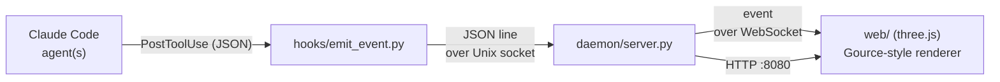

# graph-agents

**Real-time web visualization** of what each Claude Code agent is doing — creating, editing,
and deleting files and directories — rendered with the look of
[Gource](https://gource.io/). Unlike Gource (a desktop binary), it runs in the browser.

Each agent shows up as an **actor** emitting beams toward the files it touches; files are
bright colored dots on a force-laid-out directory tree with a _bloom_ effect — Gource's
signature look.

> **Status:** working web MVP, verified end to end. The in-browser visual has not been
> validated visually yet. See [Status and limitations](#status-and-limitations).

---

## How it works

We neither reimplement capture from scratch nor embed Gource's code: we leverage
**Claude Code hooks** to capture file operations and reproduce Gource's look in WebGL
(three.js).



1. **Capture** — a `PostToolUse` hook (on `Write`/`Edit`/`MultiEdit`/`Bash`) fires
   `hooks/emit_event.py`, which merely **forwards** the raw event JSON. The hook is _pure
   stdlib_, dependency-free, and **always exits with code 0** — it never stalls the Claude
   Code session.
2. **Normalization + aggregation** — `daemon/server.py` receives the events over a _Unix
   socket_, normalizes each one into the wire format, and decides `A` (added) vs `M`
   (modified) by keeping the set of already-seen paths (no filesystem probing on the hot
   path).
3. **Transport** — the daemon rebroadcasts each event over **WebSocket** and serves the
   frontend over HTTP.
4. **Rendering** — the browser draws the tree with d3-force + three.js (`UnrealBloomPass`).

### Event format (WebSocket, JSON)

```json
{ "ts": 1754870400.12, "agent": "agent-worker", "type": "A", "path": "src/api/users.ts", "color": "33FF33" }
```

`type` is `A`/`M`/`D`; `color` is hex without `#` (A→`33FF33`, M→`FFAA00`, D→`FF3333`).

---

## Requirements

- **Python 3.10+** (for the daemon; the hook uses the stdlib only).
- **Node.js 18+ / npm** — only to _build_ the frontend. If `web/dist` already exists, you can
  run without Node.

---

## Quick start

```bash
./start.sh
```

`start.sh` does the full bootstrap idempotently: it creates the `.venv`, installs the daemon
deps, generates `web/dist` (if needed), and brings the daemon up. When it finishes, open:

```
http://localhost:8080
```

### start.sh modes

| Command | Effect |
|---|---|
| `./start.sh` | prod — ensures the build and serves `web/dist` at `http://localhost:8080` |
| `./start.sh --dev` | daemon + Vite dev server with hot reload (`http://localhost:5173`) |
| `./start.sh --rebuild` | forces a reinstall/rebuild of the frontend |
| `./start.sh --no-build` | skips the frontend, serves the existing `web/dist` |
| `./start.sh --help` | help |

> `run.sh` is a minimal launcher (daemon only, assuming everything is already prepared). For
> the "from zero to running" flow, use `start.sh`.

---

## Installing capture in the observed project

The daemon only receives events if the project you want to visualize has the hook installed.
Copy the `"hooks"` block from [`config/settings.json`](config/settings.json) into the
`.claude/settings.json` **of the observed project**, adjusting the absolute path to
`emit_event.py`:

```json
{
  "hooks": {
    "PostToolUse": [
      {
        "matcher": "Write|Edit|MultiEdit|Bash",
        "hooks": [
          { "type": "command", "command": "python3 /home/brn/projects/graph-agents/hooks/emit_event.py" }
        ]
      }
    ]
  }
}
```

From then on, every file operation in that project becomes an event in the graph.

---

## Configuration

Environment variables (all optional):

| Variable | Default | Description |
|---|---|---|
| `GRAPHAGENTS_SOCKET` | `/tmp/graph-agents.sock` | Ingest Unix socket (hook ↔ daemon). |
| `GRAPHAGENTS_WS_PORT` | `8765` | WebSocket port (browser). |
| `GRAPHAGENTS_HTTP_PORT` | `8080` | HTTP port serving `web/dist`. |
| `GRAPHAGENTS_PROJECT_ROOT` | cwd | Root against which paths are made relative in the graph. |

The socket must match between the hook and the daemon; if you change one, change the other.

---

## Project structure

```
graphagents/normalize.py   # pure core: hook JSON -> Event (defensive, never raises)
hooks/emit_event.py        # hook: stdlib, forwards the event, always exit 0
daemon/server.py           # asyncio: ingest (socket) + WebSocket + static HTTP
config/settings.json       # hooks block to copy into the observed project
web/                       # TypeScript frontend (Vite)
  src/protocol.ts          #   typed event parsing/validation
  src/simulation.ts        #   pure model: directory tree, actors, fade
  src/layout.ts            #   d3-force
  src/renderer.ts          #   three.js + UnrealBloomPass (Gource look)
  src/wsClient.ts          #   WebSocket client with reconnection
tests/                     # pytest (backend)
web/tests/                 # vitest (frontend)
start.sh / run.sh          # bootstrap+run / minimal daemon launcher
```

---

## Development

This project follows **TDD** (test before code) and is developed by **specialist agents** —
see [`CLAUDE.md`](CLAUDE.md) for the rules and the workflow.

```bash
# backend (pytest)
python3 -m venv .venv && .venv/bin/pip install -e '.[dev]'
.venv/bin/python -m pytest

# frontend (vitest + type-check + build)
cd web && npm install
npm test
npm run build
```

---

## Status and limitations

- ✅ Backend: `pytest` green; the hook exits with `exit 0` on invalid input.
- ✅ Frontend: `vitest` green; `tsc` + `vite build` clean.
- ✅ End-to-end integration: a real `Write` → hook → daemon → WebSocket delivers the correct
  event; HTTP serves the built page.
- ⚠️ **In-browser visual not validated yet** — the renderer compiles and builds, but fidelity
  to Gource has not been checked with a browser open.

**Not yet implemented:**

- Per-_subagent_ attribution (today: one actor per Claude Code session).
- The paired destination `A` for Bash `mv` (today only the source `D`).
- Per-agent avatars/images.
- Session recording/replay and video export.

---

## License

[MIT](LICENSE).

- The visual is a **reimplementation** of Gource's look in WebGL; Gource's source code
  (GPLv3) is **not** used or redistributed here — which is why this project can be MIT.
- Gource: <https://gource.io/>
