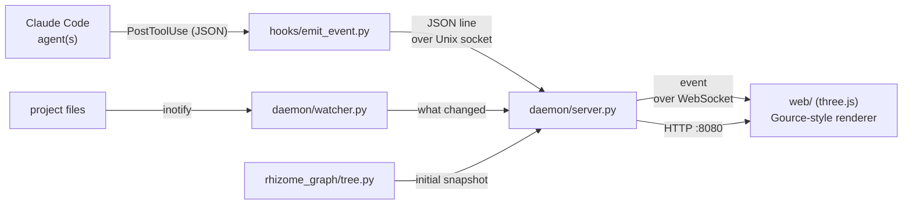

# rhizome-graph

**Real-time web visualization** of what each Claude Code agent is doing — creating, editing,
and deleting files and directories — rendered with the look of
[Gource](https://gource.io/). Unlike Gource (a desktop binary), it runs in the browser.

Each agent shows up as an **actor** emitting beams toward the files it touches; files are
bright colored dots on a force-laid-out directory tree with a _bloom_ effect — Gource's
signature look.

> **Status:** working web MVP, verified end to end. The in-browser visual has not been
> validated visually yet. See [Status and limitations](#status-and-limitations).

---

## How it works

We neither reimplement capture from scratch nor embed Gource's code: we leverage
**Claude Code hooks** to capture file operations and reproduce Gource's look in WebGL
(three.js).



**Two capture sources, on purpose.** Hooks know *who* — they carry the agent's session id —
but they only see Claude's own file tools, and they cannot resolve a glob or a compound
shell command. The filesystem watcher knows *what* — every change, whoever made it — but
nothing about authorship. The daemon combines them: a filesystem change that lands within a
few seconds of a hook inherits that hook's agent, so `cp src/*.md docs/` draws the agent's
beam at each file actually copied.

1. **Seed** — at boot the daemon walks `RHIZOME_PROJECT_ROOT` (`rhizome_graph/tree.py`,
   skipping `.git`, `node_modules`, build output) and publishes the existing tree. The page
   opens on the project, not on a blank field. Every client gets this snapshot on connect,
   however long the daemon has been up.
2. **Capture** — a `PostToolUse` hook (on `Write`/`Edit`/`MultiEdit`/`Bash`) fires
   `hooks/emit_event.py`, which merely **forwards** the raw event JSON. The hook is _pure
   stdlib_, dependency-free, and **always exits with code 0** — it never stalls the Claude
   Code session. In parallel, `daemon/watcher.py` reports real changes on disk.
3. **Normalization + aggregation** — `daemon/server.py` receives events over a _Unix
   socket_, normalizes each one, decides `A` (added) vs `M` (modified) from the set of
   already-seen paths, attributes filesystem changes to the agent that was just active, and
   drops the duplicate a single write produces on both channels.
4. **Transport** — the daemon rebroadcasts each event over **WebSocket** and serves the
   frontend over HTTP.
5. **Rendering** — the browser draws the tree with d3-force + three.js (`UnrealBloomPass`),
   with a Gource-style figure per agent firing beams at the files it touches, and names on
   the directories and on whichever files are worth naming right now (see
   [Reading the graph](#reading-the-graph)).

### Event format (WebSocket, JSON)

```json
{ "ts": 1754870400.12, "agent": "agent-worker", "type": "A", "path": "src/api/users.ts", "color": "33FF33", "origin": "hook" }
```

`type` is `A`/`M`/`D`; `color` is hex without `#` (A→`33FF33`, M→`FFAA00`, D→`FF3333`).

`origin` says what produced the event and how loudly to draw it:

| `origin` | Meaning | On screen |
|---|---|---|
| `hook` | a Claude Code tool call | file flashes, agent figure + beam |
| `watch` | a change seen on disk | file flashes; figure + beam only if attributed |
| `seed` | part of the boot snapshot | dim node, no figure, no flash |

`agent` is `""` when the change could not be credited to anyone (a seeded file, a manual
edit, a build step). Such events still show the file changing, but never invent an actor.

---

## Reading the graph

| Input | Effect |
|---|---|
| wheel / trackpad scroll | zoom under the cursor |
| drag | pan |
| double-click | hand control back to auto-fit |

The camera auto-fits the whole tree until you touch it; from then on it holds your framing,
so a label stays still long enough to read. Double-click resumes following.

**Directories are always named.** **Files are named when there is a reason to name one:**
whichever files were just touched — the name fades out with the highlight, like the file
itself — plus, once you zoom in far enough to have room, the idle files still on screen.
Naming all of them at once would be an unreadable wall of text on any real project.

Names hold the same size on screen at every zoom level: they are sized in pixels, not in
world units, so they neither shrink to nothing when the whole project is framed nor swallow
the screen when you are down to a single file.

---

## Requirements

- **Python 3.10+** (for the daemon; the hook uses the stdlib only). The daemon needs
  `websockets` and `watchdog` — `pip install -e '.[daemon]'`, or just run `./start.sh`.
- **Node.js 18+ / npm** — only to _build_ the frontend. If `web/dist` already exists, you can
  run without Node.

> If you edit anything under `web/src/`, you need Node: the daemon serves the built
> `web/dist` from disk, and `start.sh` **silently serves a stale build** when Node is
> missing — a front-end change then looks like it did nothing. Rebuild with
> `./start.sh --rebuild`.

---

## Quick start

```bash
./start.sh
```

`start.sh` does the full bootstrap idempotently: it creates the `.venv`, installs the daemon
deps, generates `web/dist` (if needed), and brings the daemon up. When it finishes, open:

```
http://localhost:8080
```

### start.sh modes

| Command | Effect |
|---|---|
| `./start.sh` | prod — ensures the build and serves `web/dist` at `http://localhost:8080` |
| `./start.sh --dev` | daemon + Vite dev server with hot reload (`http://localhost:5173`) |
| `./start.sh --rebuild` | forces a reinstall/rebuild of the frontend |
| `./start.sh --no-build` | skips the frontend, serves the existing `web/dist` |
| `./start.sh --help` | help |

> `run.sh` is a minimal launcher (daemon only, assuming everything is already prepared). For
> the "from zero to running" flow, use `start.sh`.

---

## Installing capture in the observed project

The daemon only receives events if the project you want to visualize has the hook installed.
Copy the `"hooks"` block from [`config/settings.json`](config/settings.json) into the
`.claude/settings.json` **of the observed project**, adjusting the absolute path to
`emit_event.py`:

```json
{
  "hooks": {
    "PostToolUse": [
      {
        "matcher": "Write|Edit|MultiEdit|Bash",
        "hooks": [
          { "type": "command", "command": "python3 /path/to/rhizome-graph/hooks/emit_event.py" }
        ]
      }
    ]
  }
}
```

From then on, every file operation in that project becomes an event in the graph.

**Hook changes only take effect in a new session** — Claude Code reads `settings.json` at
startup, so a session that was already open when you installed the block keeps running
without it.

The hook is not what makes changes appear: the watcher reports those on its own. The hook is
what puts a **name and a figure** on them. Without it you still see the tree move, with no
actor attached.

### When nothing shows up

The hook swallows every error by design, so a daemon that is not running looks exactly like
a healthy setup with nothing to report. To tell them apart, point `RHIZOME_DEBUG_LOG` at
a file in the observed project's hook command:

```json
{ "type": "command", "command": "RHIZOME_DEBUG_LOG=/tmp/rhizome-graph-hook.log python3 /path/to/rhizome-graph/hooks/emit_event.py" }
```

Failures are appended there. Unset, the hook stays completely silent.

---

## Configuration

Environment variables (all optional):

| Variable | Default | Description |
|---|---|---|
| `RHIZOME_SOCKET` | `/tmp/rhizome-graph.sock` | Ingest Unix socket (hook ↔ daemon). |
| `RHIZOME_HTTP_PORT` | `8080` | Single port serving `web/dist` **and** the WebSocket at `/ws`. |
| `RHIZOME_PROJECT_ROOT` | cwd | Root the daemon seeds, watches, and makes paths relative to. |
| `RHIZOME_DEBUG_LOG` | _unset_ | Set on the **hook** to append its failures to that file. Unset = total silence. |

The socket must match between the hook and the daemon; if you change one, change the other.

`RHIZOME_PROJECT_ROOT` is the project you want to *watch* — set it to the observed
project, not to `rhizome-graph` itself:

```bash
RHIZOME_PROJECT_ROOT=/path/to/observed/project ./start.sh
```

`RHIZOME_WS_PORT` is obsolete: the page and the WebSocket share one port, so the browser
derives the socket URL from the origin it loaded from. Viewing over SSH or VS Code remote
therefore needs only `RHIZOME_HTTP_PORT` forwarded — a hard-coded `localhost` WebSocket
port would otherwise resolve to the *viewer's* machine and never connect.

---

## Project structure

```
rhizome_graph/normalize.py   # pure core: hook JSON -> Event (defensive, never raises)
rhizome_graph/tree.py        # boot snapshot of the project tree (the seed events)
hooks/emit_event.py        # hook: stdlib, forwards the event, always exit 0
daemon/server.py           # asyncio: ingest + seed + attribution + WebSocket + HTTP
daemon/watcher.py          # inotify watcher: what changed, whoever changed it
config/settings.json       # hooks block to copy into the observed project
web/                       # TypeScript frontend (Vite)
  src/protocol.ts          #   typed event parsing/validation
  src/simulation.ts        #   pure model: directory tree, actors, fade
  src/layout.ts            #   d3-force
  src/view.ts              #   pure: zoom/pan camera state
  src/labels.ts            #   pure: label size, placement, which files get named
  src/avatar.ts            #   the agent figure, painted on a canvas
  src/renderer.ts          #   three.js + UnrealBloomPass (Gource look)
  src/wsClient.ts          #   WebSocket client with reconnection
.claude/agents/            # the specialist agents that develop this repo
tests/                     # pytest (backend)
web/tests/                 # vitest (frontend)
start.sh / run.sh          # bootstrap+run / minimal daemon launcher
```

---

## Development

`renderer.ts` needs a WebGL context and so cannot be unit-tested. Every decision worth
testing therefore lives in a pure sibling that imports neither three.js nor the DOM —
`simulation.ts`, `view.ts`, `labels.ts` — and the renderer only draws what they return. New
front-end logic belongs in one of those, not in the renderer.

This project follows **TDD** (test before code) and is developed by **specialist agents**
defined in [`.claude/agents/`](.claude/agents) — see [`CLAUDE.md`](CLAUDE.md) for the rules
and the workflow.

```bash
# backend (pytest)
python3 -m venv .venv && .venv/bin/pip install -e '.[dev]'
.venv/bin/python -m pytest

# frontend (vitest + type-check + build)
cd web && npm install
npm test
npm run build
```

---

## Status and limitations

- ✅ Backend: 97 `pytest` green; the hook exits with `exit 0` on invalid input.
- ✅ Frontend: 87 `vitest` green; `tsc` + `vite build` clean.
- ✅ End-to-end integration, verified against a live daemon: the tree is seeded on connect, a
  `Write` flashes exactly once across both channels, `cp *.md docs/` reports each file
  actually copied and credits the agent, `rm -rf docs/` prunes the subtree, and an edit made
  outside any agent shows up without an actor.
- ⚠️ **In-browser visual not validated yet** — the renderer compiles, builds and passes its
  unit tests, but fidelity to Gource has not been checked with a browser open.

**Not yet implemented:**

- Per-_subagent_ attribution (today: one actor per Claude Code session).
- Custom avatar *images* per agent (today: a generated figure tinted by agent color).
- Attribution is time-based: a filesystem change is credited to whichever agent acted in the
  last few seconds. Two agents writing at the same instant can be credited to one of them.
- `.gitignore` is not parsed — the seed and the watcher skip a fixed list of noisy
  directories instead.
- Session recording/replay and video export.

---

## License

[MIT](LICENSE).

- The visual is a **reimplementation** of Gource's look in WebGL; Gource's source code
  (GPLv3) is **not** used or redistributed here — which is why this project can be MIT.
- Gource: <https://gource.io/>
